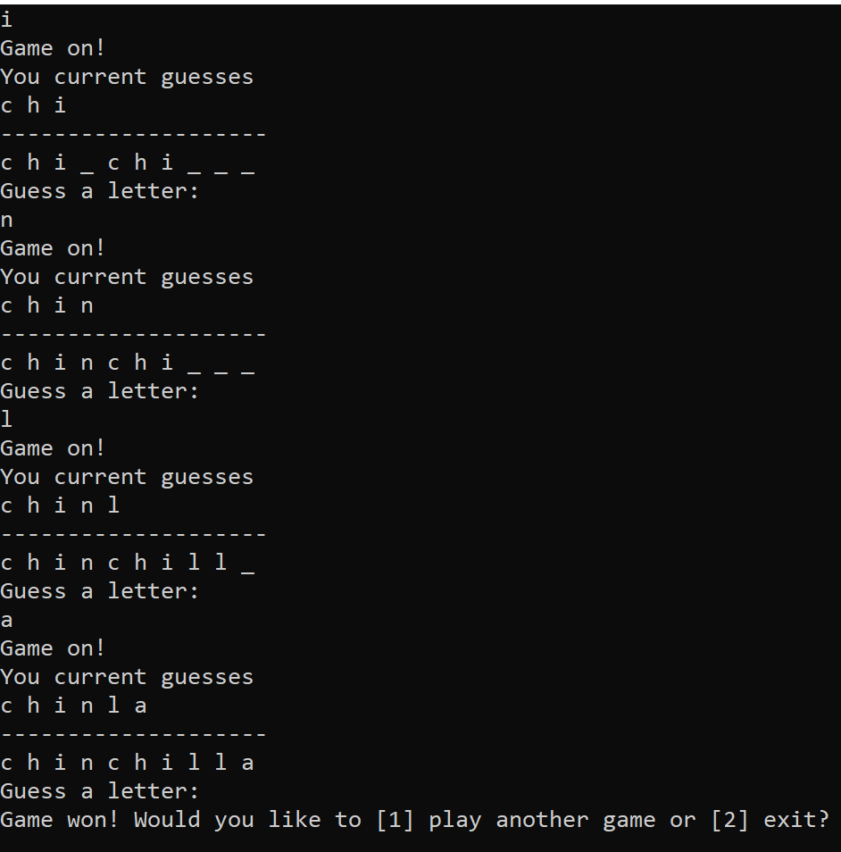

# Lab3 WordGuessGame

## Problem Domain

Josie Cat has requested that a “Word Guess Game” be built. The main idea of the game is she must guess what a mystery word is by inputting (1) letter at a time. The game should save all of her guesses (both correct and incorrect) throughout each session of the game, along with the ability to show her how many letters out of the word she has guessed correctly.

## Getting Started

Open the project with Visual Studio, and run (Ctrl + F5). 

Alternatively, you can navigate to project directory containing Program.cs file with PowerShell, then do the following.

 ```
 dotnet run
 ```

 ## Visual

 